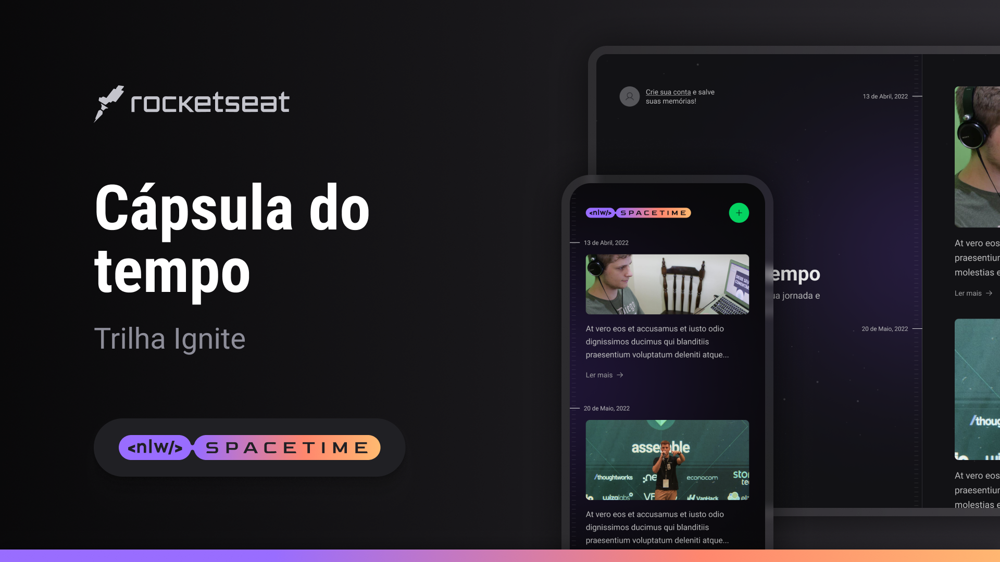

<h1 align="center">
  
</h1>

  <a href="#-tecnologias">Tecnologias</a>&nbsp;&nbsp;&nbsp;|&nbsp;&nbsp;&nbsp;
  <a href="#-projeto">Projeto</a>&nbsp;&nbsp;&nbsp;|&nbsp;&nbsp;&nbsp;
  <a href="#-sobre">Sobre</a>&nbsp;&nbsp;&nbsp;|&nbsp;&nbsp;&nbsp;

 

  

## 🚀 Tecnologias

Esse projeto foi desenvolvido com as seguintes tecnologias:

- [ReactJs](https://react.dev/)
- [Tailwindcss](https://tailwindcss.com/)
- [TypeScript](https://www.typescriptlang.org/)
- [NodeJs](https://nodejs.org/en)
- [Fastify](https://www.fastify.io/)
- [Prisma](https://www.prisma.io/)
- [React Native](https://reactnative.dev/)
- [Expo](https://expo.io/)
- [Nativewind](https://www.nativewind.dev/)

## 💻 Projeto

Na trilha Ignite vamos desenvolver uma aplicação full-stack, do back-end ao mobile, que funcionará como uma cápsula do tempo guardando memórias passadas numa timeline. Vamos utilizar React, Tailwind, Node, Fastify, TypeScript, Expo, Next.js e muito mais!

## 📜 Sobre

Este é um projeto desenvolvido durante a **[Next Level Week](https://nextlevelweek.com/)**, apresentado por **[@Rocketseat](https://github.com/Rocketseat)** de 15 a 19 de maio de 2023.  

